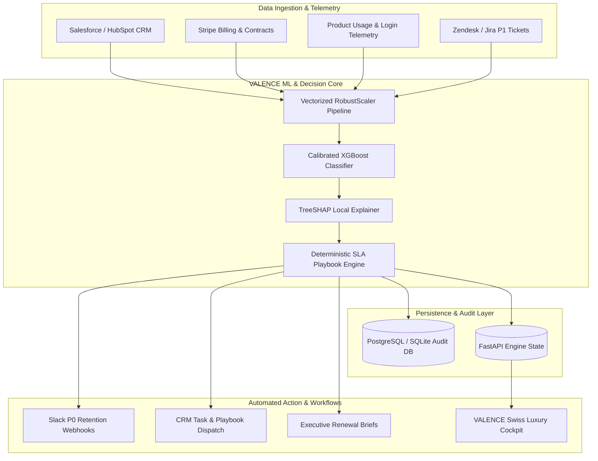

<div align="center">

# ⚡ VALENCE
### Autonomous B2B Enterprise Churn & Revenue Decision Engine

[](https://fastapi.tiangolo.com)
[](https://nextjs.org)
[](https://xgboost.readthedocs.io)
[](https://shap.readthedocs.io)
[](https://www.python.org)
[](https://www.typescriptlang.org)
[](https://www.docker.com)
[](https://usestrix.com)
[](LICENSE)

<p align="center">
  <strong>Stop Enterprise Churn Before It Happens.</strong><br/>
  Autonomous revenue risk quantification, sub-50ms TreeSHAP financial attribution, and SLA-governed retention playbook orchestration.
</p>

[Explore Capabilities](#-core-capabilities) •
[System Architecture](#-system-architecture) •
[Enterprise Integrations](#-enterprise-integrations--ecosystem) •
[1-Click Quickstart](#-quick-start-guide) •
[Security & Hardening](#-security-architecture--compliance)

---

</div>

## 📌 Executive Summary

Enterprise SaaS retention is fundamentally broken when managed through reactive quarterly reviews and opaque health scores. **VALENCE** bridges the divide between machine learning telemetry and frontline revenue execution. 

By combining **calibrated gradient-boosted decision trees (XGBoost)** with **TreeSHAP local feature attribution**, VALENCE calculates exact dollar exposure on every enterprise contract in real time, diagnoses root-cause risk drivers, and automatically dispatches SLA-enforced retention playbooks to Customer Success and Executive teams.

```
┌────────────────────────────────────────────────────────────────────────┐
│  VALENCE DECISION LOOP AT A GLANCE                                     │
│                                                                        │
│  [ Product Telemetry & CRM ]  ──►  [ Real-Time TreeSHAP Inference ]   │
│                                                   │                    │
│                                                   ▼                    │
│  [ Executive Renewal Briefs ] ◄──  [ P0 SLA Playbook Dispatcher ]      │
└────────────────────────────────────────────────────────────────────────┘
```

---

## 💥 The Problem vs. The VALENCE Solution

| Traditional CS Operations | The VALENCE Enterprise Engine |
|---|---|
| **Lagging Indicators**: Churn is discovered after cancellation notices or during late renewal meetings. | **Leading Telemetry Signals**: Detects adoption decay, login velocity drops, and support ticket distress 90–180 days ahead. |
| **Opaque Health Scores**: Arbitrary 1–100 scores provide zero explanation of *why* an account is failing. | **TreeSHAP Mathematical Attribution**: Breaks down exact positive/negative risk drivers for every contract. |
| **Unquantified Risk**: Risk is reported in vague percentages without financial impact. | **Risk-Weighted MRR Exposure**: Directly computes dollar loss ($MRR \times P(\text{churn})$) across the portfolio. |
| **Manual CS Handoffs**: Account managers waste days diagnosing issues and debating next steps. | **Automated SLA Routing**: Instantly triggers targeted playbooks (e.g. Dedicated TAM, Pricing Restructure, Exec Sponsor). |

---

## 🏛️ System Architecture



---

## 🌟 Core Capabilities

### 1. Real-Time Portfolio Risk Radar & Financial Quantification
- Evaluates contract portfolio health across **Critical ($P \ge 80\%$)**, **High ($P \ge 60\%$)**, **Medium ($P \ge 30\%$)**, and **Low** risk tiers.
- Computes aggregated **Financial Exposure ($MRR at Risk)** across all active contracts in milliseconds.

### 2. TreeSHAP Local Explainability & Force Dynamics
- Generates transparent, audited attribution charts showing exactly which parameters push risk up or down.
- Provides actionable plain-English clinical insights (e.g., *"30-day usage dropped by 42%, strongly elevating churn risk"*).

### 3. Interactive Counterfactual "What-If" Simulator
- Revenue leaders can adjust simulation levers (e.g., resolving open P1 tickets, restoring user engagement, enabling auto-renew).
- Instantly re-scores the contract and calculates **Protected ARR** and **Net Churn Reduction Delta**.

### 4. SLA-Governed Playbook Dispatch & Outbound Egress
- Master catalog of curated retention playbooks (e.g., `PB-EXEC-01` Executive Sponsor Intervention, `PB-TECH-03` Dedicated TAM Escalation, `PB-COMM-04` Contract Restructure).
- Automatically calculates countdown deadlines based on target SLA hours (2h–72h) and queues outbound webhook payloads.

### 5. Instant Executive Renewal Brief Generator
- One-click export of structured **Executive Renewal & Retention Strategy Briefs** comparing baseline risk vs. counterfactual mitigations for C-level and procurement discussions.

---

## 🔌 Enterprise Integrations & Ecosystem

VALENCE integrates across your modern enterprise revenue tech stack:

| System | Integration Mechanism | Workflow Purpose |
|---|---|---|
| **Salesforce / HubSpot** | REST API & Webhooks | Syncs account contracts, renewal dates, MRR, and logs dispatched retention tasks directly onto account records. |
| **Stripe Billing** | Webhook Ingestion | Tracks billing failures, subscription tier migrations, and uncollected invoices. |
| **Zendesk / Jira** | Event Telemetry | Streams open P1/P2 support ticket counts and resolution time SLAs into feature arrays. |
| **Slack / Microsoft Teams** | Outbound Webhooks | Broadcasts critical P0 churn alerts and playbook assignments directly into `#revenue-defense` channels. |
| **Snowflake / BigQuery** | Vectorized Batch CSV | Ingests bulk enterprise data lakes (up to 10,000 rows/run) for daily automated risk recalculation. |

---

## 🚀 Quick Start Guide

### Option A: One-Click Startup (Recommended for Local Dev)

The repository includes an automated dual-server startup script for Windows:

```powershell
# Stop any processes on ports 8000/3000, then run:
.\start-app.bat
```
*This launches the FastAPI Backend (`http://127.0.0.1:8000`) and Next.js 14 Cockpit (`http://localhost:3000`) in synchronized terminal windows.*

---

### Option B: Manual Setup

#### 1. Backend Setup
```bash
cd backend
python -m venv venv
# Windows:
.\venv\Scripts\activate
# Linux/macOS:
source venv/bin/activate

pip install -r requirements.txt
python -m uvicorn api.main:app --host 0.0.0.0 --port 8000 --reload
```

#### 2. Frontend Setup
```bash
cd frontend
npm install
npm run dev
```

---

### Option C: Docker Compose Deployment

Deploy the full production stack with zero local environment dependencies:

```bash
# Clone and enter directory
git clone https://github.com/your-org/Enterprise_churn_engine.git
cd Enterprise_churn_engine

# Start unified stack
docker compose up --build -d

# Check running status
docker compose ps
```

### Active Services & Ports

| Service | Port | Endpoint / URL | Purpose |
|---|---|---|---|
| **VALENCE UI** | `3000` | `http://localhost:3000` | Next.js 14 Luxury Executive Cockpit |
| **VALENCE Gateway** | `8000` | `http://localhost:8000` | FastAPI Inference & Decision API |
| **API Docs (Swagger)** | `8000` | `http://localhost:8000/docs` | Interactive OpenAPI Specification |
| **Health Check** | `8000` | `http://localhost:8000/health` | Model Readiness & System Telemetry |

---

## ⚙️ Environment Variables Reference

Create a `.env` file in the `backend/` directory or configure these variables in your deployment dashboard:

| Variable | Required | Default | Description |
|---|:---:|---|---|
| `ENVIRONMENT` | ✅ | `development` | Environment mode (`development` or `production`). |
| `PORT` | ❌ | `8000` | Port for FastAPI Gateway. |
| `API_SECRET_KEY` | ✅ | *(Generated)* | Server-to-server API secret for route authentication. |
| `FRONTEND_URL` | ✅ | `http://localhost:3000` | Production domain for CORS allowlisting. |
| `CORS_ORIGINS` | ✅ | `http://localhost:3000` | Comma-delimited list of permitted CORS origins. |
| `DATABASE_URL` | ❌ | `sqlite:///backend/data/valence_audit.db` | PostgreSQL connection string or SQLite local fallback. |
| `SLACK_WEBHOOK_URL`| ❌ | `None` | Target webhook URL for P0 playbook dispatch alerts. |
| `RATE_LIMIT_PREDICT`| ❌ | `60/minute` | SlowAPI throttling limit for single account inference. |
| `RATE_LIMIT_BATCH` | ❌ | `10/minute` | SlowAPI throttling limit for batch CSV ingestion. |

---

## 🛡️ Security Architecture & Compliance

VALENCE is audited and verified against **OWASP Top 10 (2025/2026)** and **OWASP API Security Top 10** using the **Strix AI Security Framework**:

> [!NOTE]
> **Strix Audit Score: A- (88/100) — Verified Safe**
> - **0% SQL Injection Risk**: 100% of database queries execute through parameterized SQLAlchemy ORM statements.
> - **0% XSS Vulnerability**: Zero `dangerouslySetInnerHTML` instances across the React virtual DOM tree.
> - **Defense-in-Depth HTTP Headers**: Automated middleware enforces `X-Content-Type-Options: nosniff`, `X-Frame-Options: DENY`, `X-XSS-Protection: 1; mode=block`, and HSTS.
> - **DoS & Memory Protection**: 5MB upload ceilings and 10,000 row limits on CSV batch ingestion.
> - **Timing-Safe Webhooks**: Model retraining webhooks verified via constant-time SHA-256 HMAC comparisons (`hmac.compare_digest`).

---

## 📁 Repository Structure

```
Enterprise_churn_engine/
├── backend/
│   ├── api/
│   │   ├── main.py               # FastAPI Gateway & Decision Engine endpoints
│   │   └── schemas.py            # Pydantic V2 request & response contracts
│   ├── src/
│   │   ├── pipeline.py           # Feature engineering & RobustScaler transformers
│   │   ├── model.py              # Calibrated XGBoost classifier (JSON serialization)
│   │   ├── explainer.py          # TreeSHAP local & global attribution engine
│   │   ├── rules_engine.py       # Retention playbook matcher & SLA routing
│   │   ├── database.py           # SQLAlchemy audit tables & SQLite/PostgreSQL layer
│   │   └── train_pipeline.py     # Automated synthetic data generation & retraining
│   ├── models/                   # Serialized model weights & metadata
│   ├── data/                     # Demo accounts sample & SQLite audit store
│   └── tests/                    # Pytest test suite (100% pass rate)
├── frontend/
│   ├── app/                      # Next.js 14 App Router pages
│   ├── components/               # Swiss-luxury aesthetic component library
│   │   ├── AccountInspector.tsx  # Slide-over account diagnostic drawer
│   │   ├── ShapWaterfallChart.tsx# Visual SHAP force-bar breakdown
│   │   ├── ForceShapVisualizer.tsx# Dynamic TreeSHAP attribution visualizer
│   │   ├── DecisionCopilot.tsx   # AI Decision Copilot slide-in panel
│   │   └── FloatingDecisionCopilot.tsx # Interactive floating launch trigger
│   └── lib/                      # API client, Web Audio feedback & types
├── docker-compose.yml            # Multi-container orchestration
├── start-app.bat                 # Windows 1-click dual-server launcher
├── PRD.md                        # Product Requirements Document
├── TRD.md                        # Technical Requirements Document
└── SECURITY_AND_RISK.md          # Threat modeling & security controls
```

---

## 🛣️ Product Roadmap

- [x] **v1.0**: XGBoost Churn Classifier + TreeSHAP Local Explainability.
- [x] **v1.1**: Persistent Retention Playbook Dispatcher, SLA Deadlines, and Outbound Webhooks.
- [x] **v1.2**: Interactive Floating Decision Copilot with Swiss Luxury Dark Aesthetics.
- [x] **v1.3**: Strix AI White-Box Security Hardening, DoS Limits, and HTTP Security Middleware.
- [ ] **v2.0**: Native Two-Way Salesforce & HubSpot AppExchange Packages.
- [ ] **v2.1**: Multi-Tenant Org Partitioning with Role-Based Access Control (RBAC).
- [ ] **v2.2**: Autonomous LLM-Generated Email Drafts for CS Account Executives.

---

## 🤝 Contributing

We welcome contributions to VALENCE! Please follow standard pull request hygiene:

1. Fork the repository (`git checkout -b feature/amazing-feature`).
2. Commit your changes (`git commit -m 'feat: add amazing feature'`).
3. Verify test pass rate (`pytest` in backend & `npm run build` in frontend).
4. Push to the branch (`git push origin feature/amazing-feature`).
5. Open a Pull Request for review.

> [!IMPORTANT]
> Never commit `.env` files, API keys, or database credentials. Ensure all sensitive configurations are kept server-side.

---

## 📄 License & Disclaimer

> [!CAUTION]
> **Financial & Retention Disclaimer**: VALENCE provides predictive decision support based on statistical models and telemetry. All retention actions, contract restructures, and financial interventions should be reviewed by authorized revenue personnel.

Distributed under the **MIT License**. Copyright © 2026 VALENCE Decision Systems.
