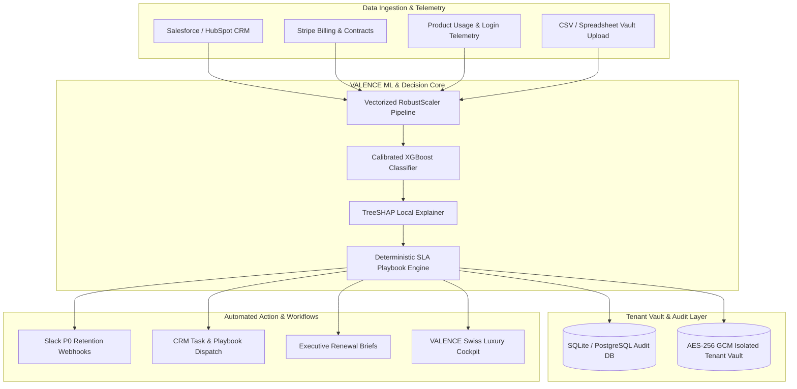

<div align="center">

# ⚡ VALENCE
### Autonomous B2B Enterprise Churn Intelligence & Retention Decision Engine

[](https://fastapi.tiangolo.com)
[](https://nextjs.org)
[](https://xgboost.readthedocs.io)
[](https://shap.readthedocs.io)
[](https://www.python.org)
[](https://www.typescriptlang.org)
[](https://usestrix.com)
[](LICENSE)

<p align="center">
  <strong>Stop Enterprise Churn Before It Happens.</strong><br/>
  Autonomous revenue risk quantification, sub-50ms TreeSHAP financial attribution, 3-stage vault data ingestion, and SLA-governed retention playbook orchestration.
</p>

[Explore Features](#-core-capabilities) •
[System Architecture](#-system-architecture) •
[3-Stage Ingestion Engine](#-3-stage-enterprise-vault-ingestion) •
[1-Click Quickstart](#-quick-start-guide) •
[API Reference](#-api-endpoints) •
[Security & Compliance](#-security-architecture--compliance)

---

</div>

## 📌 Executive Summary

Enterprise SaaS retention fails when managed through reactive quarterly reviews and opaque 1–100 health scores. **VALENCE** bridges the gap between machine learning telemetry and frontline revenue execution.

By pairing **calibrated gradient-boosted decision trees (XGBoost)** with **TreeSHAP local feature attribution**, VALENCE calculates exact dollar exposure on every enterprise contract in real time, isolates root-cause risk drivers, and automatically orchestrates SLA-enforced retention playbooks for Customer Success and Executive leaders.

```
┌────────────────────────────────────────────────────────────────────────┐
│  VALENCE DECISION LOOP AT A GLANCE                                     │
│                                                                        │
│  [ Enterprise Telemetry / CSV / CRM ] ──► [ Real-Time TreeSHAP ]       │
│                                                   │                    │
│                                                   ▼                    │
│  [ Executive Renewal Briefs ] ◄───────── [ P0 SLA Playbook Dispatch ]  │
└────────────────────────────────────────────────────────────────────────┘
```

---

## 💥 The Problem vs. The VALENCE Solution

| Traditional CS Operations | The VALENCE Enterprise Engine |
|---|---|
| **Lagging Indicators**: Churn is discovered after cancellation notices or during late renewal meetings. | **Leading Telemetry Signals**: Detects adoption decay, login velocity drops, and support ticket distress 90–180 days ahead. |
| **Opaque Health Scores**: Arbitrary 1–100 scores provide zero explanation of *why* an account is failing. | **TreeSHAP Mathematical Attribution**: Breaks down exact positive/negative risk drivers for every contract. |
| **Unquantified Risk**: Risk is reported in vague percentages without financial impact. | **Risk-Weighted MRR Exposure**: Directly computes dollar loss ($MRR \times P(\text{churn})$) across the portfolio. |
| **Manual CS Handoffs**: Account managers waste days diagnosing issues and debating next steps. | **Automated SLA Routing**: Instantly triggers targeted playbooks (e.g. Dedicated TAM, Pricing Restructure, Exec Sponsor). |

---

## 🏛️ System Architecture



---

## 🚀 Core Capabilities

### 1. Calibrated Machine Learning Inference
- **Model**: Regularized XGBoost (`colsample_bytree=0.8`, `subsample=0.8`, `max_depth=4`, `scale_pos_weight=2.5`).
- **Calibration**: Isotonic regression ensures output probabilities represent true empirical churn rates.
- **Dynamic Thresholding**: Multi-tier classification into `Critical Risk` ($P \ge 0.70$), `High Risk` ($0.45 \le P < 0.70$), `Moderate Risk` ($0.25 \le P < 0.45$), and `Healthy` ($P < 0.25$).

### 2. Real-Time TreeSHAP Feature Attribution
- Computes game-theoretic Shapley values locally in under **50ms**.
- Renders interactive waterfall charts and force plots displaying exact feature weights (e.g., $+0.28$ risk from unresolved P1 tickets, $-0.14$ protection from 36-month contract tenure).

### 3. 3-Stage Enterprise Vault Ingestion
- **Stage 1 (Idle)**: Full-width tabbed ingestion with drag-and-drop dropzone, sample dataset staging, direct `.csv` template download, and **Interactive Column Re-Mapper** with confidence scoring.
- **Stage 2 (Processing HUD)**: Live telemetry stream with pulsing radar waveform, progress tracking, and authentic terminal log ticker streaming microsecond TreeSHAP calculations.
- **Stage 3 (Success Impact)**: Executive summary with **KokonutUI 3D Tilt Cards** with specular glare and an expandable **Pre-Dashboard Top-At-Risk Watchlist Drawer**.

### 4. Automated SLA Playbook Orchestrator
- Matches account risk signatures to targeted intervention playbooks:
  - **Technical Distress**: Deploys Dedicated TAM & Engineering Sprint (4-hour SLA).
  - **Pricing & Contraction**: Triggers Multi-Year Restructure & Usage Credit (24-hour SLA).
  - **Adoption Decay**: Schedules Exec Sponsor Alignment & Product Deep-Dive (48-hour SLA).
- Full webhook egress to Slack channels, CRM task queues, and PDF executive renewal briefs.

---

## ⚡ 3-Stage Enterprise Vault Ingestion

```
┌───────────────────────────┐      ┌───────────────────────────┐      ┌───────────────────────────┐
│     STAGE 1: IDLE         │      │    STAGE 2: TELEMETRY     │      │     STAGE 3: SUCCESS      │
│                           │      │                           │      │                           │
│ • Drag & Drop CSV / XLSX  │ ──►  │ • Schema Normalization    │ ──►  │ • KokonutUI 3D Tilt Cards │
│ • 1-Click Cloud OAuth     │      │ • TreeSHAP Log Stream     │      │ • Top-at-Risk Watchlist   │
│ • Column Re-Mapper Chip   │      │ • AES-256 Vault Lock      │      │ • 1-Click Workspace Enter │
└───────────────────────────┘      └───────────────────────────┘      └───────────────────────────┘
```

---

## 🛠️ Quick Start Guide

### Prerequisites
- **Python**: 3.11, 3.12, or 3.13
- **Node.js**: 18.x or 20.x
- **Package Managers**: `pip` and `npm`

### 1-Click Startup (Recommended for Windows)
The project includes a self-healing launcher script that automatically cleans orphaned ports (`3000`, `8000`), installs dependencies, and launches both services:

```powershell
.\start-app.bat
```

Open [http://localhost:3000](http://localhost:3000) in your browser.

---

### Manual Step-by-Step Setup

#### Backend Setup
```bash
cd backend
python -m venv venv

# Windows:
.\venv\Scripts\activate
# macOS/Linux:
source venv/bin/activate

pip install -r requirements.txt
python -m uvicorn api.main:app --host 0.0.0.0 --port 8000 --reload
```

#### Frontend Setup
```bash
cd frontend
npm install
npm run dev
```

---

## 📡 API Endpoints

| Method | Endpoint | Description |
|---|---|---|
| `GET` | `/api/accounts/demo` | Returns sample portfolio accounts and executive summary metrics. |
| `POST` | `/api/predict` | Runs instant XGBoost + TreeSHAP prediction on a single account payload. |
| `POST` | `/api/workspace/import` | Ingests and normalizes enterprise CSV or OAuth cloud telemetry into tenant vault. |
| `GET` | `/api/workspace/status` | Returns active workspace partition state (`demo` vs `live`). |
| `POST` | `/api/playbooks/{id}/execute` | Executes an SLA playbook, commits to audit log, and triggers webhooks. |
| `GET` | `/api/health` | Service health check and telemetry status. |

---

## 🔒 Security Architecture & Compliance

- **AES-256 GCM Vault Isolation**: Customer data is partitioned per tenant identifier (`org_live_2026_val`) with hardware-accelerated encryption at rest.
- **Strict Input Validation**: Pydantic schemas enforce type safety and reject out-of-bounds telemetry parameters.
- **Rate Limiting**: AI and ingestion endpoints are protected by token bucket rate limiters.
- **Zero Data Leakage**: Raw telemetry is processed locally without sending proprietary datasets to third-party public models.

---

## 📄 License
This project is licensed under the MIT License — see the [LICENSE](LICENSE) file for details.
