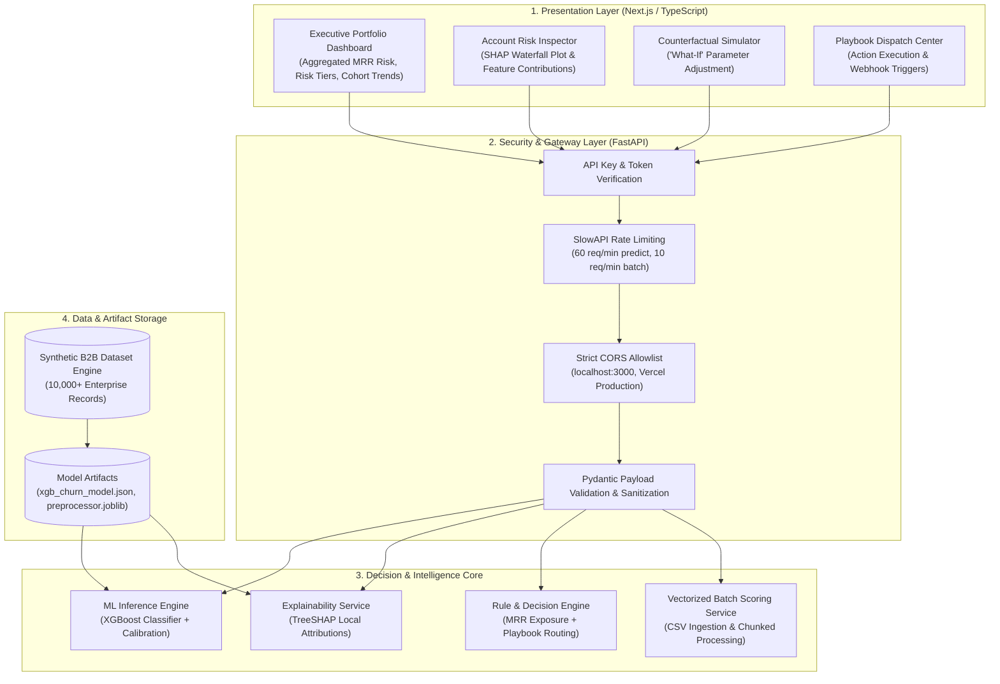

# System Design Document (SDD)
## Enterprise Churn & Revenue Decision Engine

**Document Metadata:**
- **Version:** 1.0.0
- **Status:** Architecture Approved
- **Target Stack:** Next.js (App Router, TypeScript, Tailwind CSS), FastAPI (Python 3.11+), XGBoost, SHAP, Docker

---

## 1. Executive Architecture Overview

The **Enterprise Churn & Revenue Decision Engine** is an enterprise-grade AI decision intelligence system designed for Customer Success and Revenue Operations teams. It proactively predicts churn risk, quantifies revenue exposure, interprets local churn drivers using SHAP (Shapley Additive Explanations), and matches accounts to actionable retention playbooks.



---

## 2. Core Subsystems & Components

### 2.1 Synthetic B2B Data Generation Engine (`src/data_generator.py`)
Generates 10,000+ synthetic B2B SaaS accounts incorporating realistic non-linear relationships and business churn patterns:
- **Contract Profile:** `contract_mrr` ($500 - $50,000), `contract_tier` (Standard, Professional, Enterprise), `tenure_months` (1 - 60).
- **Product Telemetry:** `days_since_last_login` (0 - 90), `usage_change_pct_30d` (-100% to +200%), `active_user_ratio` (0.0 - 1.0), `api_calls_monthly` (count).
- **Support & Health:** `open_p1_tickets` (0 - 5), `avg_resolution_time_hrs` (1 - 72), `nps_score` (0 - 10), `csat_score` (1.0 - 5.0).
- **Billing & Contract:** `payment_failures_past_quarter` (0 - 4), `days_until_renewal` (1 - 365), `auto_renew_enabled` (Boolean).
- **Target Variable:** `churned` (Binary 0 or 1), engineered with realistic cross-feature dependencies and ~18-22% base churn rate.

### 2.2 Machine Learning & Inference Pipeline (`src/model.py`)
- **Algorithm:** `xgboost.XGBClassifier` with `objective="binary:logistic"`, `eval_metric="auc"`.
- **Class Imbalance Management:** Calculates `scale_pos_weight = N_retained / N_churned`.
- **Feature Engineering & Preprocessing:**
  - Robust scaling for skewed financial/telemetry metrics (`contract_mrr`, `api_calls_monthly`).
  - Median/Mode imputers with missing-value indicator flags.
  - One-hot encoding for categorical variables.
- **Model Validation:** 5-fold Stratified K-Fold Cross-Validation optimizing ROC-AUC and Recall on the churn class.

### 2.3 Explainability Core (`src/explainer.py`)
- **Engine:** `shap.TreeExplainer` applied directly to the trained tree ensemble.
- **Extraction Protocol:**
  - Extracts expected base value $\mathbb{E}[f(X)]$.
  - Generates exact local Shapley values $\phi_i(x)$ for each feature.
  - Formats output into user-friendly directionality (`increases_risk` vs. `decreases_risk`) with human-readable diagnostic summaries.

### 2.4 Decision & Playbook Engine (`src/rules_engine.py`)
- **Financial Exposure:**
  $$\text{Expected MRR Loss} = P_{\text{churn}} \times \text{Contract MRR}$$
- **Risk Categorization:**
  - **Low:** $P_{\text{churn}} < 0.30$
  - **Medium:** $0.30 \le P_{\text{churn}} < 0.60$
  - **High:** $0.60 \le P_{\text{churn}} < 0.80$
  - **Critical:** $P_{\text{churn}} \ge 0.80$
- **Playbook Mapping Rules:**
  - **Rule 1 (Product Disengagement):** If `usage_change_pct_30d` $\le -30\%$ $\to$ *TAM Re-engagement & Executive QBR*.
  - **Rule 2 (Critical Support Distress):** If `open_p1_tickets` $\ge 1$ or `avg_resolution_time_hrs` $> 36$ $\to$ *Engineering Escalation & Incident Review*.
  - **Rule 3 (Billing Friction):** If `payment_failures_past_quarter` $\ge 1$ $\to$ *Finance Dunning Audit & Payment Optimization*.
  - **Rule 4 (Imminent High-Value Renewal):** If `days_until_renewal` $\le 60$ and `contract_mrr` $> \$5,000$ and $P_{\text{churn}} \ge 0.50$ $\to$ *Custom Renewal Incentive & Executive Alignment*.

---

## 3. API Specifications & Contracts

### 3.1 Single Account Prediction & Explanation
- **Endpoint:** `POST /api/v1/predict`
- **Request Headers:** `X-API-Key: <secret_key>`, `Content-Type: application/json`
- **Request Body:**
```json
{
  "account_id": "ACC-8910",
  "company_name": "Acme Global",
  "contract_mrr": 8500.00,
  "tenure_months": 16,
  "days_since_last_login": 14,
  "usage_change_pct_30d": -45.2,
  "open_p1_tickets": 2,
  "nps_score": 4,
  "payment_failures_past_quarter": 1,
  "days_until_renewal": 45,
  "contract_tier": "Enterprise"
}
```

- **Response Body (200 OK):**
```json
{
  "account_id": "ACC-8910",
  "company_name": "Acme Global",
  "churn_probability": 0.864,
  "risk_tier": "Critical",
  "contract_mrr": 8500.00,
  "mrr_at_risk": 7344.00,
  "base_margin": -1.24,
  "top_drivers": [
    {
      "feature": "usage_change_pct_30d",
      "display_name": "Usage Decline (30d)",
      "value": -45.2,
      "shap_value": 0.412,
      "impact": "increases_risk",
      "insight": "Usage dropped 45.2% in the last 30 days, heavily increasing churn probability."
    },
    {
      "feature": "open_p1_tickets",
      "display_name": "Open P1 Tickets",
      "value": 2,
      "shap_value": 0.325,
      "impact": "increases_risk",
      "insight": "2 unresolved critical severity tickets are causing acute customer friction."
    },
    {
      "feature": "tenure_months",
      "display_name": "Account Tenure",
      "value": 16,
      "shap_value": -0.095,
      "impact": "decreases_risk",
      "insight": "Established 16-month relationship provides modest protective baseline."
    }
  ],
  "recommended_playbooks": [
    {
      "playbook_id": "PB-SUPP-01",
      "title": "Critical Support Escalation",
      "priority": "P0",
      "action_summary": "Escalate 2 open P1 tickets directly to VP of Engineering and schedule an emergency executive sync.",
      "assignee_role": "VP Engineering / CS Lead"
    },
    {
      "playbook_id": "PB-ENGAGE-02",
      "title": "TAM Feature Adoption Audit",
      "priority": "P1",
      "action_summary": "Deploy TAM to run workflow audit and deliver targeted training sessions for disengaged users.",
      "assignee_role": "Technical Account Manager"
    }
  ],
  "generated_at": "2026-09-29T23:30:00Z"
}
```

### 3.2 Batch CSV Prediction
- **Endpoint:** `POST /api/v1/batch-predict`
- **Request Form-Data:** `file: <accounts.csv>`
- **Response:** Enriched JSON summary + download stream of scored CSV.

### 3.3 Health & Telemetry
- **Endpoint:** `GET /health`
- **Response:**
```json
{
  "status": "healthy",
  "model_loaded": true,
  "model_version": "1.0.0",
  "explainer_ready": true,
  "uptime_seconds": 1842,
  "timestamp": "2026-09-29T23:30:00Z"
}
```

---

## 4. Frontend Architecture (Next.js 14+ / React)

```
frontend/
├── app/
│   ├── layout.tsx              # Root shell with dark/light tokens & navbar
│   ├── page.tsx                # Executive Overview (KPIs, Risk Distribution, MRR loss)
│   ├── accounts/
│   │   ├── page.tsx            # Full Accounts Directory (Filterable, sortable)
│   │   └── [id]/page.tsx       # Single Account Inspector (SHAP waterfall, Playbooks)
│   ├── simulator/page.tsx      # What-If Simulator with dynamic recalculation
│   ├── batch/page.tsx          # CSV Upload & Batch Intelligence Processor
│   └── api/                    # Next.js BFF proxy to FastAPI
├── components/
│   ├── ui/                     # Glassmorphic cards, badges, buttons, modals
│   ├── charts/                 # SHAP Waterfall visualizer, Risk Bar, MRR Cohort
│   ├── playbooks/              # Playbook dispatch modal & webhook trigger status
│   └── tables/                 # Virtualized account risk table
├── lib/
│   ├── api.ts                  # Typed Axios/Fetch client with retry & fallback
│   ├── types.ts                # Strict TypeScript interfaces matching backend models
│   └── utils.ts                # Currency, percentage, and risk tier formatters
```
